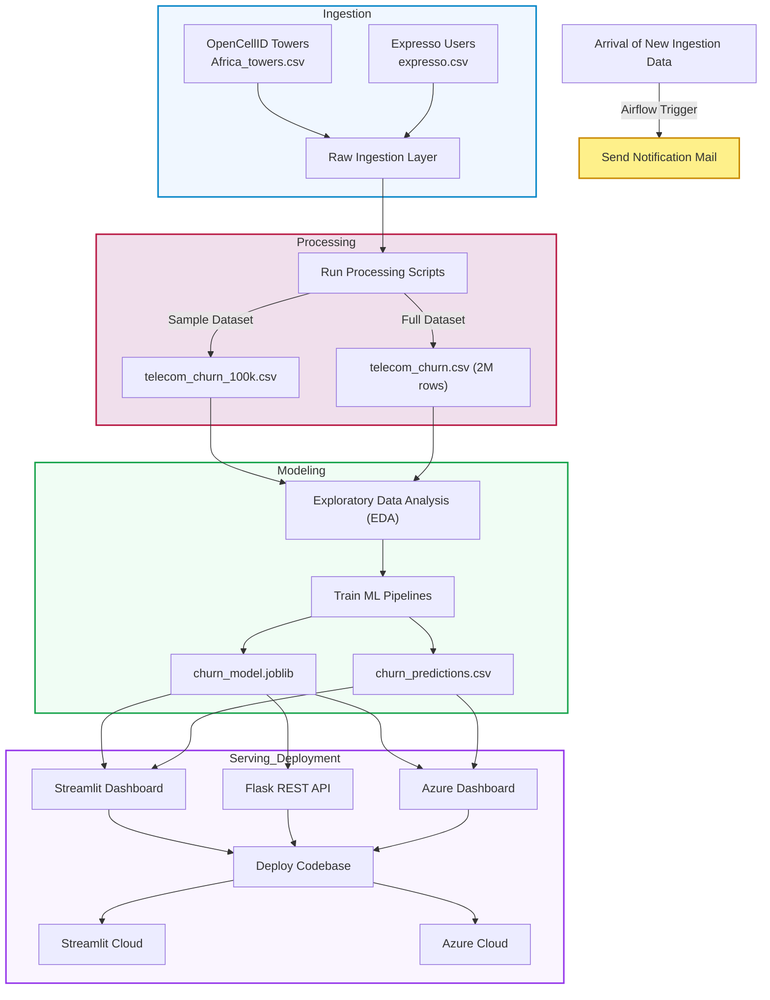

# Telecom AI-Enhanced Data Pipeline Customer Churn Prediction

A production-grade telecom data engineering and AI pipeline that integrates **technical telecom infrastructure data** with **customer business data** to predict **customer churn** using machine learning.

# Project Overview

Telecom operators generate large volumes of **network performance data** and **customer behavioral data**, yet these datasets are often siloed and underutilized for proactive churn prevention.

This project designs and implements an **AI-enhanced telecom data pipeline** that integrates:

- **Technical network data** (OpenCellID telecom tower data)
- **Customer business data** (Expresso telecom customer behavior)

to automate:

- data ingestion
- feature engineering
- churn prediction
- model inference
- reporting
- orchestration
- monitoring

The pipeline enables telecom stakeholders to take **data-driven retention actions** through automated churn prediction and operational dashboards.


# Milestones

## Milestone 1 — Data Collection & Feature Engineering

* Data ingestion
* Feature extraction
* Data preprocessing

## Milestone 2 — AI Model Integration

* Churn prediction model
* Model inference
* Evaluation

## Milestone 3 — Pipeline Automation & Deployment

* Airflow automation
* REST API deployment
* End-to-end testing

## Milestone 4 — Monitoring & Reporting

* Logging
* Monitoring
* Streamlit dashboard


# Technologies 

| Layer | Technology |
|---|---|
| Raw & Processed Data Storage | Huawei Object Storage Service (OBS) / Azure Blob Storage |
| Cloud Database | Huawei Relational Database Service (RDS) / PostgreSQL |
| Cloud Data Warehouse | Huawei Data Warehouse Service (DWS) |
| Data Processing | Python (pandas, dask, geopandas) |
| Compute | Huawei Elastic Compute Service (ECS) / Azure VM |
| ML Model | LightGBM |
| Model Hosting | Huawei ModelArts |
| Workflow Orchestration | Apache Airflow on ECS |
| REST API | Flask  |
| Dashboard | Streamlit |
| Containerization | Docker + Docker Compose |


# Objectives

The project aims to:

- Integrate telecom **technical** and **business** datasets
- Build an **automated churn prediction pipeline**
- Deliver **operational and business insights**
- Enable **proactive customer retention**


# Project Structure

```text
telecom_churn_pipeline/
├── dags/
│   └── telecom_churn_dag.py          ← Airflow DAG (single source of truth)
│
├── src/
│   ├── ingestion/
│   │   └── ingestion.py              ← Stage 1: ingest_data()
│   ├── processing/
│   │   └── processing.py             ← Stage 2: transform_data()
│   ├── modeling/
│   │   └── modeling.py               ← Stage 3: run_model_inference()
│   ├── serving/
│   │   └── serving.py                ← Stage 4: serve_predictions()
│   ├── api/
│   │   └── app.py                    ← Flask REST API
│   └── logger.py                     ← Centralized logging
│
├── config/
│   └── config.py                     ← All paths, constants, hyperparameters
│
├── data/
│   ├── raw/                          ← Place source CSVs here
│   └── processed/                    ← Generated intermediate datasets
│
├── models/                           ← Versioned .joblib files + symlink
├── outputs/                          ← Predictions CSV, metrics, reports
├── logs/                             ← Rotating pipeline log file
│
├── docker-compose.yml                ← Airflow + PostgreSQL + Flask API
├── Dockerfile.api                    ← Flask API container image
├── requirements.txt
└── .env.example                      ← Copy to .env and fill in credentials
```

# Datasets 

## [Expresso Dataset](docs/expresso.md)

Expresso Telecom is an African telecommunications company providing airtime and mobile data bundles in Senegal.

The Expresso dataset contains customer-level telecom data including:

### Customer Behavior

* tenure
* recharge amount
* recharge frequency
* revenue
* data usage
* call activity
* package subscriptions

### Target Variable

```text
churn
```

Where:

```text
0 = Non-Churn
1 = Churn
```

A customer is considered churned if inactive for **90 consecutive days**.

| Property | Value |
|---|---|
| Variables | 19 |
| Rows | 2,154,048 |
| Source | [Zindi Expresso Churn Challenge](https://zindi.africa/competitions/expresso-churn-prediction) |
| Download | [Zindi Data Page](https://zindi.africa/competitions/expresso-churn-prediction/data) |


## [OpenCellID Dataset](docs/opencellid.md)

Global open database of cellular network infrastructure. Updated daily; includes towers observed in the last 18 months.

The OpenCellID dataset provides:

* telecom tower information
* network quality indicators
* signal strength
* geographic coordinates
* coverage range

A filtered subset of OpenCellID containing Senegal cell tower data with a **90-day observation window** — aligned with the Expresso churn definition (90 consecutive inactive days = churned) from an extensive dataset that provide geographic coordinates and network information for cell tower locations across the globe, organized by continent.

**Filters applied:**
- Senegal only: `MCC = 608`
- Expresso network only: `MNC = 3`
- 90-day activity window: `2019-04-01` to `2019-07-01`

### Filtering Rules

The dataset is filtered to:

### Country Filter

```text
MCC = 608
```

(Mobile Country Code for Senegal)

### Network Filter

```text
MNC = 3
```

(Expresso Network)

### Observation Window

A **90-day observation window** is used to align with churn definition.

| Property | Value |
|---|---|
| Senegal subset size | 14 variables, 2,709 samples (MCC=608) |
| Download | [Cell Towers Worldwide: Location Data by Continent](https://www.kaggle.com/datasets/zakariaeyoussefi/cell-towers-worldwide-location-data-by-continent) |


## [telecom_churn Dataset](docs/telecom_churn.md)

The `telecom_churn` dataset is the **integration** of the OpenCellID and Expresso datasets — directly satisfying the project requirement to *"integrate technical and business datasets to predict customer churn."*

It contains behavioral, transactional, usage, and network-quality variables for mobile subscribers in Senegal.


The final integrated dataset:

```text
telecom_churn.csv
```

combines:

```text
Expresso + OpenCellID
```

through **region-based geospatial enrichment**.

### Final Dataset Includes

#### Customer Features

* recharge behavior
* spending behavior
* usage activity
* telecom interactions

#### Network Features

* tower density
* signal strength
* coverage index
* network quality scores

### Summary of Variables 

\#  Customer identifiers  
   "user\_id", "region"

\#  Customer behaviour  
 "tenure", "montant", "frequence\_rech", "revenue", "arpu\_segment",  
 "frequence", "data\_volume", "on\_net", "orange", "tigo",  
  "zone1", "zone2", "mrg", "regularity", "top\_pack", "freq\_top\_pack",

\#  Region-level network KPIs  (ADM1)  
 "region\_tower\_count", "region\_avg\_range", "region\_avg\_samples", "region\_avg\_signal",  
 "region\_coverage\_index", "region\_signal\_strength\_index", "region\_network\_quality\_score",

\#  Department-level network KPIs  (ADM2, aggregated to region)  
 "department\_signal\_strength\_index", "department\_network\_quality\_score",  
  "department\_coverage\_index",

\#  Arrondissement-level network KPIs  (ADM3, aggregated to region)  
 "arr\_signal\_strength\_index", "arr\_network\_quality\_score", "arr\_coverage\_index",

 \#  Target  
   "churn"


| Property | Value |
|---|---|
| Variables | 32 |
| Rows | 2,154,048 |

### telecom_churn_100k Dataset

A reproducible **100,000-row subset** of `telecom_churn` used for model training and evaluation.

| Property | Value |
|---|---|
| Variables | 32 |
| Rows | 100,000 |


# Feature Engineering

Geospatial processing merges cellular tower specifications into administrative geographical tiers (ADM1 Regions, ADM2 Departments, ADM3 Arrondissements) using a point-in-polygon spatial index join via `GeoPandas` and `Shapely` to calculate  network quality scores

The project generates telecom network KPIs at:

## ADM1 — Region Level

* tower count
* average range
* signal quality
* coverage index

## ADM2 — Department Level

* signal strength index
* network quality score
* coverage index

## ADM3 — Arrondissement Level

* signal strength index
* network quality score
* coverage index

### KPI Formula

#### Coverage Index

```text
coverage_index =
tower_count × avg_range
```

#### Signal Strength Index

```text
signal_strength_index =
avg_signal / avg_samples
```

#### Network Quality Score

```text
network_quality_score =
0.4 × signal_strength_index
+ 0.3 × tower_count
+ 0.3 × avg_samples
```

# Machine Learning

An optimized, calibrated LightGBM classification machine learning model pipeline. 

Target Encoding and SMOTE transformations are isolated strictly inside the pipeline execution to completely prevent data leakage across evaluation sets.


## Workflow



# Data Pipeline Stages

## Stage 1 — `ingest_data()`

| Function | Description |
|---|---|
| `validate_raw_inputs()` | Schema-checks all source files before heavy compute |
| `ingest_opencellid()` | Dask load → Senegal/Expresso filter → 90-day window → CSV |
| `ingest_expresso_sample()` | Chunk-sampling 100 k rows with `random_state=42` |
| `download_gadm_geopackage()` | Cached GADM download with retry logic |
| `send_notification_email()` | Email  notification on ingestion success |

## Stage 2 — `transform_data()`

| Function | Description |
|---|---|
| `load_gadm_boundaries()` | Loads ADM1/2/3 layers from GeoPackage |
| `build_tower_geodataframe()` | Converts tower lat/lon to Shapely Point GeoDataFrame |
| `spatial_join_towers()` | Point-in-polygon join at each admin level |
| `compute_network_kpis()` | Aggregates 7 KPIs per zone (coverage, signal, quality) |
| `compute_all_regional_kpis()` | Runs joins at all 3 levels + roll-ups to Region |
| `merge_network_kpis_dask()` | Broadcast-merge 3 small KPI tables into 2M Dask DF |
| `validate_processed_output()` | Checks row counts, churn distribution, schema |

## Stage 3 — `run_model_inference()`

| Function | Description |
|---|---|
| `load_training_data()` | Loads `telecom_churn_100k.csv` |
| `engineer_features()` | 7-step feature engineering (notebook-identical) |
| `define_feature_sets()` | Identifies num/cat columns |
| `split_data()` | Stratified 70/15/15 split |
| `build_pipeline()` | Leak-free ImbPipeline (impute→encode→scale→SMOTE→LGB) |
| `run_hyperparameter_search()` | RandomizedSearchCV (20 iter, 5-fold, ROC-AUC) |
| `calibrate_model()` | Isotonic CalibratedClassifierCV on validation set |
| `tune_threshold()` | F1-optimal threshold sweep on validation set |
| `evaluate_model()` | Full metrics report + business KPIs on test set |
| `segment_customers()` | Risk × Value matrix segmentation |

## Stage 4 — `serve_predictions()`

| Function | Description |
|---|---|
| `load_predictions()` | Loads modeling-stage output CSV |
| `load_model_metadata()` | Reads versioned `.joblib` payload |
| `validate_predictions()` | Enforces output schema contract |
| `enrich_predictions()` | Adds human-readable labels + model version |
| `save_predictions()` | Final `churn_predictions.csv` |
| `save_high_risk_customers()` | CRM export of High-risk segment |
| `export_model_info()` | `model_info.json` for Flask API |
| `produce_executive_summary()` | Plain-text business report |


# Prediction Parity Guarantee

Every step that affects model output is preserved verbatim from the notebooks:

| Notebook logic | Production implementation |
|---|---|
| Column drop list (ZERO_VAR, COLLINEAR, SPARSE, ID) | `config.py → ZERO_VAR_COLS` etc. |
| Feature engineering order (flags → ratios → log → engagement → tenure) | `engineer_features()` — same order |
| `random_state=42` throughout | `config.py → SEED = 42` |
| Stratified 70/15/15 split | `split_data()` — identical split fractions |
| TargetEncoder `smoothing=10, min_samples_leaf=5` | `build_pipeline()` |
| SMOTE `k_neighbors=5` inside ImbPipeline | `build_pipeline()` |
| LightGBM `class_weight="balanced"` | `build_pipeline()` |
| RandomizedSearchCV `n_iter=20, cv=5, scoring=roc_auc` | `run_hyperparameter_search()` |
| Isotonic calibration on val set | `calibrate_model()` |
| Threshold sweep 0.10 → 0.90, step 0.01 | `tune_threshold()` |
| Risk tiers: High≥0.7, Medium≥0.4, Low<0.4 | `config.py → RISK_TIERS` |


# Quick Start

## Prerequisites

- Docker ≥ 24 and Docker Compose V2
- 16 GB RAM recommended (Dask processes 2 M rows)
- `Africa_towers.csv` and `expresso.csv` in `data/raw/`

### Steps

```bash
# 1. Clone and configure
cp .env.example .env
# Edit .env — set SMTP credentials, API_KEY

# 2. Initialise Airflow DB (run once)
docker compose --profile init up airflow-init

# 3. Start all services
docker compose up -d

# 4. Open Airflow UI
open http://localhost:8080
# Login: airflow / airflow

# 5. Enable and trigger the DAG
# In the UI: toggle "telecom_ai_churn_pipeline" ON → click ▶ to trigger

# 6. Monitor task logs in real time
docker compose logs -f airflow-scheduler

# 7. Check the Flask API
curl http://localhost:5000/health
curl -X POST http://localhost:5000/predict \
     -H "Content-Type: application/json" \
     -H "X-API-Key: your-secure-api-key" \
     -d '{"revenue": 5000, "regularity": 25, "frequence": 12}'
```

### Run a single stage locally (development)

```bash
# Install dependencies in a virtual environment
python -m venv venv && source venv/bin/activate
pip install -r requirements.txt

export TELECOM_BASE_DIR=$(pwd)
export TELECOM_PROJECT_ROOT=$(pwd)

python -m src.ingestion.ingestion     # Stage 1
python -m src.processing.processing   # Stage 2
python -m src.modeling.modeling       # Stage 3
python -m src.serving.serving         # Stage 4
```


## Airflow DAG Reference

**DAG ID**: `telecom_ai_churn_pipeline`

| Task ID | Operator | Callable | Timeout |
|---|---|---|---|
| `ingest_data` | PythonOperator | `ingest_data()` | default |
| `send_notification_email` | PythonOperator | `send_notification_email()` | default |
| `transform_data` | PythonOperator | `transform_data()` | 2 hours |
| `run_model_inference` | PythonOperator | `run_model_inference()` | 3 hours |
| `serve_predictions` | PythonOperator | `serve_predictions()` | default |
| `pipeline_complete_email` | EmailOperator | *(built-in)* | default |

**Dependency graph**:
```
ingest_data ──► transform_data ──► run_model_inference ──► serve_predictions ──► pipeline_complete_email
    └──────────────────────────────────────────────────────► send_notification_email
```


# Flask REST API Reference

Base URL: `http://localhost:5000`

| Method | Endpoint | Auth | Description |
|---|---|---|---|
| GET | `/health` | No | Liveness probe |
| POST | `/predict` | Yes | Single customer inference |
| POST | `/predict/batch` | Yes | Batch inference (≤10,000 records) |
| GET | `/model/info` | Yes | Model metadata + metrics |
| POST | `/model/reload` | Yes | Hot-reload model after DAG run |
| GET | `/predictions` | Yes | Latest batch predictions summary |

Authentication: set `X-API-Key: <API_KEY>` header.


## Environment Variables

| Variable | Default | Description |
|---|---|---|
| `TELECOM_BASE_DIR` | `/opt/airflow` | Project root on Airflow worker |
| `NOTIFY_EMAIL_TO` | `team@example.com` | Alert recipients |
| `SMTP_HOST` | `smtp.example.com` | SMTP server hostname |
| `SMTP_PORT` | `587` | SMTP port |
| `SMTP_USER` | *(empty)* | SMTP username |
| `SMTP_PASSWORD` | *(empty)* | SMTP password |
| `TELECOM_DAG_SCHEDULE` | `@daily` | Cron/preset schedule |
| `API_KEY` | *(empty)* | Flask API key (empty = auth off) |
| `AZURE_STORAGE_CONNECTION_STRING` | *(empty)* | Azure Blob Storage connection |


## Azure VM Deployment

1. **Create VM** — Ubuntu 22.04, min 8 vCPU / 16 GB RAM.
2. **Open NSG ports** — 8080 (Airflow), 5000 (Flask), 8501 (Streamlit).
3. **Install Docker** — `curl -fsSL https://get.docker.com | sh`.
4. **Upload source files** — copy `Africa_towers.csv` and `expresso.csv` to `data/raw/`.
5. **Configure `.env`** — set SMTP and Azure credentials.
6. **Initialise and start** — follow the Quick Start steps above.
7. **Model reload signal** — the DAG's `serve_predictions` task calls
   `POST /model/reload` on the Flask API via Airflow's `SimpleHttpOperator`
   (add to the DAG after `t_serve` if needed).


# Future Enhancements

* Real-time streaming inference
* Model drift monitoring
* MLOps deployment
* CI/CD integration
* Kafka streaming
* Data quality monitoring
* Automated retraining


# Team Members

1. Ayman Ibrahim Aly
2. Hossam Elbadry Elneny
3. Mahmoud Farouk Ali
4. Mohamed Hassan Sayed
5. Omar Saeed Ali

# License

[MIT License](LICENSE.md)