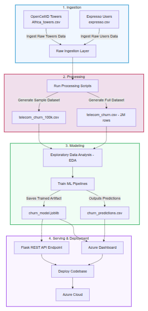

# Telecom AI-Enhanced Data Pipeline Customer Churn Prediction

A production-grade telecom data engineering and AI pipeline that integrates **technical telecom infrastructure data** with **customer business data** to predict **customer churn** using machine learning.

# Project Overview

Telecom operators generate large volumes of **network performance data** and **customer behavioral data**, yet these datasets are often siloed and underutilized for proactive churn prevention.

This project designs and implements an **AI-enhanced telecom data pipeline** that integrates:

- **Technical network data** (OpenCellID telecom tower data)
- **Customer business data** (Expresso telecom customer behavior)

to automate:

- data ingestion
- feature engineering
- churn prediction
- model inference
- reporting
- orchestration
- monitoring

The pipeline enables telecom stakeholders to take **data-driven retention actions** through automated churn prediction and operational dashboards.


# Milestones

## Milestone 1 — Data Collection & Feature Engineering

* Data ingestion
* Feature extraction
* Data preprocessing

## Milestone 2 — AI Model Integration

* Churn prediction model
* Model inference
* Evaluation

## Milestone 3 — Pipeline Automation & Deployment

* Airflow automation
* REST API deployment
* End-to-end testing

## Milestone 4 — Monitoring & Reporting

* Logging
* Monitoring
* Streamlit dashboard


# Technologies 

| Layer | Technology |
|---|---|
| Raw & Processed Data Storage | Huawei Object Storage Service (OBS) / Azure Blob Storage |
| Cloud Database | Huawei Relational Database Service (RDS) / PostgreSQL |
| Cloud Data Warehouse | Huawei Data Warehouse Service (DWS) |
| Data Processing | Python (pandas, dask, geopandas) |
| Compute | Huawei Elastic Compute Service (ECS) / Azure VM |
| ML Model | LightGBM |
| Model Hosting | Huawei ModelArts |
| Workflow Orchestration | Apache Airflow on ECS |
| REST API | Flask  |
| Dashboard | Streamlit |
| Containerization | Docker + Docker Compose |


# Objectives

The project aims to:

- Integrate telecom **technical** and **business** datasets
- Build an **automated churn prediction pipeline**
- Deliver **operational and business insights**
- Enable **proactive customer retention**


# Project Structure

```text
telecom_churn_pipeline/
├── dags/churn_pipeline.py            # Airflow TaskFlow DAG
├── scripts/                          # CLI entrypoints (00–06)
├── src/                              # Shared library (14 modules)
│   ├── paths.py                      # CHURN_BASE_DIR-driven paths
│   ├── config.py                     # YAML-loaded constants
│   ├── logging_setup.py              # Centralised logging
│   ├── validation.py                 # Pandera-style schema checks
│   ├── idempotency.py                # @skip_if_fresh decorator
│   ├── sampling.py / geo.py / ...
│   └── modeling.py / inference.py
├── tests/                            # Pytest (29 unit tests)
├── dashboards/churn_dashboard_app.py # Streamlit + Senegal map
├── notebooks/                        # Original 15 reference notebooks
├── config/config.yaml                # Hyperparameters + thresholds
├── docker-compose.yaml               # Airflow + Postgres + Streamlit
├── Dockerfile.airflow
├── pyproject.toml                    # ruff + mypy + pytest config
├── Makefile                          # make smoke / test / docker-up
├── requirements.txt
└── .github/workflows/ci.yml          # GitHub Actions
```

# Datasets 

## [Expresso Dataset](docs/expresso.md)

Expresso Telecom is an African telecommunications company providing airtime and mobile data bundles in Senegal.

The Expresso dataset contains customer-level telecom data including:

### Customer Behavior

* tenure
* recharge amount
* recharge frequency
* revenue
* data usage
* call activity
* package subscriptions

### Target Variable

```text
churn
```

Where:

```text
0 = Non-Churn
1 = Churn
```

A customer is considered churned if inactive for **90 consecutive days**.

| Property | Value |
|---|---|
| Variables | 19 |
| Rows | 2,154,048 |
| Source | [Zindi Expresso Churn Challenge](https://zindi.africa/competitions/expresso-churn-prediction) |
| Download | [Zindi Data Page](https://zindi.africa/competitions/expresso-churn-prediction/data) |


## [OpenCellID Dataset](docs/opencellid.md)

Global open database of cellular network infrastructure. Updated daily; includes towers observed in the last 18 months.

The OpenCellID dataset provides:

* telecom tower information
* network quality indicators
* signal strength
* geographic coordinates
* coverage range

A filtered subset of OpenCellID containing Senegal cell tower data with a **90-day observation window** — aligned with the Expresso churn definition (90 consecutive inactive days = churned) from an extensive dataset that provide geographic coordinates and network information for cell tower locations across the globe, organized by continent.

**Filters applied:**
- Senegal only: `MCC = 608`
- Expresso network only: `MNC = 3`
- 90-day activity window: `2019-04-01` to `2019-07-01`

### Filtering Rules

The dataset is filtered to:

### Country Filter

```text
MCC = 608
```

(Mobile Country Code for Senegal)

### Network Filter

```text
MNC = 3
```

(Expresso Network)

### Observation Window

A **90-day observation window** is used to align with churn definition.

| Property | Value |
|---|---|
| Senegal subset size | 14 variables, 2,709 samples (MCC=608) |
| Download | [Cell Towers Worldwide: Location Data by Continent](https://www.kaggle.com/datasets/zakariaeyoussefi/cell-towers-worldwide-location-data-by-continent) |


## [telecom_churn Dataset](docs/telecom_churn.md)

The `telecom_churn` dataset is the **integration** of the OpenCellID and Expresso datasets — directly satisfying the project requirement to *"integrate technical and business datasets to predict customer churn."*

It contains behavioral, transactional, usage, and network-quality variables for mobile subscribers in Senegal.


The final integrated dataset:

```text
telecom_churn.csv
```

combines:

```text
Expresso + OpenCellID
```

through **region-based geospatial enrichment**.

### Final Dataset Includes

#### Customer Features

* recharge behavior
* spending behavior
* usage activity
* telecom interactions

#### Network Features

* tower density
* signal strength
* coverage index
* network quality scores

### Summary of Variables 

\#  Customer identifiers  
   "user\_id", "region"

\#  Customer behaviour  
 "tenure", "montant", "frequence\_rech", "revenue", "arpu\_segment",  
 "frequence", "data\_volume", "on\_net", "orange", "tigo",  
  "zone1", "zone2", "mrg", "regularity", "top\_pack", "freq\_top\_pack",

\#  Region-level network KPIs  (ADM1)  
 "region\_tower\_count", "region\_avg\_range", "region\_avg\_samples", "region\_avg\_signal",  
 "region\_coverage\_index", "region\_signal\_strength\_index", "region\_network\_quality\_score",

\#  Department-level network KPIs  (ADM2, aggregated to region)  
 "department\_signal\_strength\_index", "department\_network\_quality\_score",  
  "department\_coverage\_index",

\#  Arrondissement-level network KPIs  (ADM3, aggregated to region)  
 "arr\_signal\_strength\_index", "arr\_network\_quality\_score", "arr\_coverage\_index",

 \#  Target  
   "churn"


| Property | Value |
|---|---|
| Variables | 32 |
| Rows | 2,154,048 |

### telecom_churn_100k Dataset

A reproducible **100,000-row subset** of `telecom_churn` used for model training and evaluation.

| Property | Value |
|---|---|
| Variables | 32 |
| Rows | 100,000 |


# Feature Engineering

Geospatial processing merges cellular tower specifications into administrative geographical tiers (ADM1 Regions, ADM2 Departments, ADM3 Arrondissements) using a point-in-polygon spatial index join via `GeoPandas` and `Shapely` to calculate  network quality scores

The project generates telecom network KPIs at:

## ADM1 — Region Level

* tower count
* average range
* signal quality
* coverage index

## ADM2 — Department Level

* signal strength index
* network quality score
* coverage index

## ADM3 — Arrondissement Level

* signal strength index
* network quality score
* coverage index

### KPI Formula

#### Coverage Index

```text
coverage_index =
tower_count × avg_range
```

#### Signal Strength Index

```text
signal_strength_index =
avg_signal / avg_samples
```

#### Network Quality Score

```text
network_quality_score =
0.4 × signal_strength_index
+ 0.3 × tower_count
+ 0.3 × avg_samples
```

# Machine Learning

An optimized, calibrated LightGBM classification machine learning model pipeline. 

Target Encoding and SMOTE transformations are isolated strictly inside the pipeline execution to completely prevent data leakage across evaluation sets.


# Workflow



# Deployment

## Live deployments 

| Service | URL | Status |
|---|---|---|
| **Streamlit dashboard** (Azure) | https://telechurn-streamlit.thankfulsand-f5821563.eastus.azurecontainerapps.io | ✅ |
| **Flask REST API** (Azure) | https://telechurn-flask.thankfulsand-f5821563.eastus.azurecontainerapps.io | ✅ |
| **Swagger UI** (interactive API) | https://telechurn-flask.thankfulsand-f5821563.eastus.azurecontainerapps.io/ | ✅ |
| **GitHub repo** (public, MIT) | https://github.com/Mohamedhassanofficial/Telecom-Churn | ✅ |

### Documentation 

- **[`docs/API.md`](docs/API.md)** — full REST API reference (endpoints, schemas, curl + Python examples, field reference)
- **[`docs/REVIEWERS_GUIDE.md`](docs/REVIEWERS_GUIDE.md)** — 60-second / 5-minute / 2-minute reproduction recipes
- **[`docs/PIPELINE_OUTPUTS.md`](docs/PIPELINE_OUTPUTS.md)** — stage-by-stage outputs of the data pipeline (every script's artefact, with charts)
- **[`docs/SCREENSHOTS.md`](docs/SCREENSHOTS.md)** — dashboard + ML evaluation visuals

### One-liner sanity check

```bash
curl -X POST https://telechurn-flask.thankfulsand-f5821563.eastus.azurecontainerapps.io/predict \
  -H "Content-Type: application/json" \
  -d '{"revenue":50,"regularity":15,"frequence":10,"data_volume":1000,"region":"DAKAR","montant":100,"frequence_rech":5,"top_pack":"Pack 5"}'
# {"churn_probability":0.1765,"churn_prediction":0,"risk_segment":"Low","threshold":0.29}
```

## Pipeline overview

```
sample_expresso ─┐
                 ├─→ build_telecom_churn_100k ─┐
build_opencellid ┤                              ├─→ collect_telecom_paths ─→ run_eda ─→ train_model ─→ predict
                 └─→ build_telecom_churn_full ─┘
```

The DAG produces **both scales** in one run: `build_telecom_churn_100k` feeds the 100k Expresso sample → `telecom_churn_100k.csv` (~100k rows); `build_telecom_churn_full` feeds the raw 2 M Expresso → `telecom_churn.csv` (~2.15 M rows). Downstream tasks pick the scale via the `USE_FULL_DATASET` Airflow Variable.

| # | Stage | Source notebook → Python module |
|---|---|---|
| 1 | Sample Expresso (2M → 100k stratified) | `notebooks/generate_expresso_sample_100k.ipynb` → `src/sampling.py` |
| 2 | Build OpenCellID Senegal (90-day window, MCC=608, MNC=3) | `notebooks/build_opencellid_senegal_90d_dataset.ipynb` → `src/geo.py` |
| 3 | Spatial join + KPI aggregation (region / department / arrondissement) | `notebooks/build_telecom_churn_dataset.ipynb` → `src/geo.py` + `src/network_kpis.py` |
| 4 | Headless EDA report (PNGs + JSON summary) | `notebooks/Telecom Customer Churn - EDA - Project Team A.ipynb` → `src/eda.py` |
| 5 | Train LightGBM (Calibrated + SMOTE + SHAP) | `notebooks/Telecom Customer Churn - Training, Inference & Evaluation - Project Team A.ipynb` → `src/modeling.py` |
| 6 | Batch inference + risk segmentation | same notebook → `src/inference.py` |

## Quickstart

### Docker (recommended)

```bash
git clone https://github.com/Mohamedhassanofficial/Telecom-Churn.git
cd Telecom-Churn
cp .env.example .env

# Download raw data (Kaggle CLI required for expresso.csv + Africa_towers.csv)
python scripts/00_download_raw.py

docker compose build
docker compose up airflow-init
docker compose up
```

Open:
- **Airflow UI**: http://localhost:8080  (login: `airflow` / `airflow`)
- **Streamlit dashboard**: http://localhost:8501

Trigger the DAG `telecom_churn_production_pipeline` and watch the 6 tasks succeed; the dashboard auto-refreshes when `outputs/predictions/churn_predictions.csv` is rewritten.

### Local Windows / WSL

```bash
pip install -r requirements-pipeline.txt
pip install -r dashboards/requirements-dashboards.txt

set CHURN_BASE_DIR=C:\path\to\Telecom-Churn          # Windows
# export CHURN_BASE_DIR=$(pwd)                        # macOS / Linux

python scripts/05_train_model.py --no-shap
python scripts/06_predict.py
streamlit run dashboards/churn_dashboard_app.py
```

## Engineering features

| Feature | Why it matters |
|---|---|
| **TaskFlow API DAG** | Type-hinted Python, automatic XCom, fewer footguns than PythonOperator |
| **Schema validation between stages** | Catches data drift the moment it appears |
| **Idempotent task runs** | `@skip_if_fresh` makes daily runs cheap; bypass with `CHURN_FORCE_REBUILD=1` |
| **Calibrated LightGBM + SMOTE + Target encoding** | Pipeline avoids leakage and produces well-calibrated probabilities |
| **SHAP explainability** | Per-feature contribution plot saved with every training run |
| **MLflow tracking** | Auto-enables when `MLFLOW_TRACKING_URI` is set; otherwise no-op |
| **Streamlit Senegal map** | Choropleth of churn risk per ADM1 region |
| **Pytest suite + GitHub Actions CI** | ruff + mypy + 29 unit tests on every push |
| **Docker Compose for one-command stand-up** | Postgres + Airflow scheduler/webserver + Streamlit sidecar |

## Configuration

All non-path constants live in `config/config.yaml`:

```yaml
opencellid:
  mcc: 608          # Senegal
  mnc: 3            # Expresso
  window_days: 90

model:
  default_threshold: 0.42
  calibration_method: isotonic
  smote_k_neighbors: 5
```

Paths are resolved from `CHURN_BASE_DIR` (env var) by `src/paths.py` — same code runs on Windows, Linux, and inside the Docker Airflow container.

## Verification

```bash
make smoke       # compile + import smoke + lightweight unit tests
make test        # full pytest suite
make docker-up   # spin up Airflow + Streamlit
```

CI runs the same checks plus a DAG parse on every push:

```yaml
# .github/workflows/ci.yml
- ruff check src scripts dags tests
- mypy src --ignore-missing-imports
- python -m compileall -q src scripts dags tests
- pytest --cov=src --cov-report=term-missing
- airflow dags list-import-errors
```

### [Extended setup notes](docs/README_PIPELINE.md)

# Future Enhancements

* Real-time streaming inference
* Model drift monitoring
* MLOps deployment
* CI/CD integration
* Kafka streaming
* Data quality monitoring
* Automated retraining


# Team Members

1. Ayman Ibrahim Aly
2. Hossam Elbadry Elneny
3. Mahmoud Farouk Ali
4. Mohamed Hassan Sayed
5. Omar Saeed Ali

# License

[MIT License](LICENSE.md)