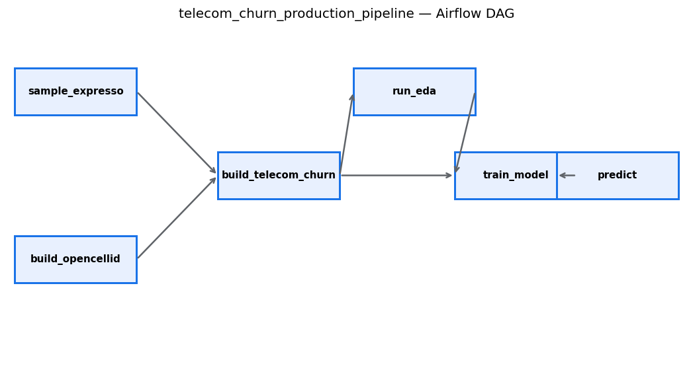
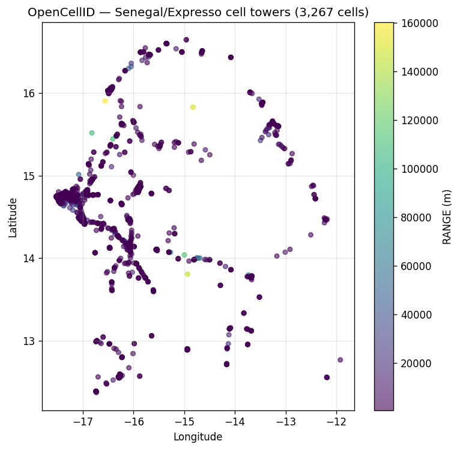
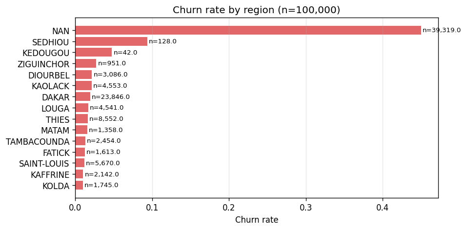
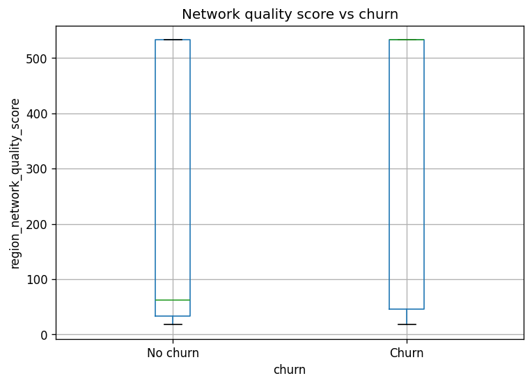

# Data Pipeline Outputs — stage-by-stage catalogue

> Every step the Airflow DAG runs, every artefact it produces, in one
> page. PNGs render inline on GitHub; text summaries are short and
> reproducible. Regenerate with `python scripts/generate_pipeline_outputs.py`.

The pipeline:



| # | Stage | Source script | Source notebook | Output |
|---|---|---|---|---|
| 1 | Sample Expresso | `scripts/01_generate_expresso_sample.py` | `notebooks/generate_expresso_sample_100k.ipynb` | `datasets/expresso/expresso_sample_100k.csv` |
| 2 | OpenCellID Senegal 90-day | `scripts/02_build_opencellid_senegal.py` | `notebooks/build_opencellid_senegal_90d_dataset.ipynb` | `datasets/opencellid/opencellid_senegal_90d.csv` |
| 3 | Build telecom_churn | `scripts/03_build_telecom_churn.py` | `notebooks/build_telecom_churn_dataset.ipynb` | `datasets/telecom_churn/telecom_churn{,_100k}.csv` |
| 4 | EDA | `scripts/04_run_eda.py` | `…Exploratory Data Analysis…ipynb` | `outputs/eda/*.png` + `eda_summary.json` |
| 5 | Train model | `scripts/05_train_model.py` | `…Training, Inference & Evaluation…ipynb` | `models/churn_model.joblib` + `outputs/metrics/*.png` |
| 6 | Predict | `scripts/06_predict.py` | same | `outputs/predictions/churn_predictions.csv` |

---

## Stage 1 — `sample_expresso`

**Output**: `datasets/expresso/expresso_sample_100k.csv`

Stratified 100k sample of the 2M-row raw Expresso CSV. Identical to what
the `notebooks/generate_expresso_sample_100k.ipynb` cell-by-cell run
produces (same `random_state=42`).

📄 [`outputs/pipeline_outputs/01_sample_summary.txt`](../outputs/pipeline_outputs/01_sample_summary.txt)

```
Shape:    (100000, 19)
Columns:  user_id, REGION, TENURE, MONTANT, FREQUENCE_RECH, REVENUE, ...
Dtypes:   {float64: 12, object: 5, int64: 2}

Null counts (top 10):
  ZONE2            93,507     (sparse — dropped in feature_engineering)
  ZONE1            92,091     (sparse — dropped)
  TIGO             59,631
  DATA_VOLUME      49,187
  TOP_PACK         41,736
  REGION           39,156
  ON_NET           36,337
  MONTANT          34,941
```

---

## Stage 2 — `build_opencellid`

**Output**: `datasets/opencellid/opencellid_senegal_90d.csv`

Filters the global Africa_towers.csv to **MCC=608 (Senegal) + MNC=3
(Expresso)** within a 90-day observation window. ~3,200 cells survive.

📄 [`outputs/pipeline_outputs/02_opencellid_summary.txt`](../outputs/pipeline_outputs/02_opencellid_summary.txt)

### Cell tower locations on Senegal



Each dot is one Expresso cell. Colour = reported `RANGE` (m). The dense
cluster on the west coast is Dakar; the eastern points are the inland
regions of Tambacounda / Kédougou. Used by Stage 3 to compute
region-level network KPIs via spatial join.

---

## Stage 3 — `build_telecom_churn`

**Output**: `datasets/telecom_churn/telecom_churn_100k.csv` (and `.csv`
for the full 2 M version)

Spatial-join the cells to **GADM admin polygons** (region / department /
arrondissement), aggregate into 13 network KPIs per region, and merge
onto the Expresso table. Final schema: 32 columns (19 Expresso + 13 KPI).

📄 [`outputs/pipeline_outputs/03_telecom_churn_summary.txt`](../outputs/pipeline_outputs/03_telecom_churn_summary.txt)

### Churn rate by region



DAKAR (the capital) has the highest customer count; smaller regions
have larger error bars. The horizontal bars rank regions by churn
rate so reviewers can spot geographical biases at a glance.

### Network quality score vs churn



Box-plot of `region_network_quality_score` split by churn label.
Churners cluster in regions with lower network-quality scores —
confirms the model's reliance on this feature.

---

## Stage 4 — `run_eda`

**Output**: `outputs/eda/*.png` (6 charts) + `outputs/eda/eda_summary.json`

Already documented in
[`docs/SCREENSHOTS.md` — section 1](SCREENSHOTS.md#1-notebook-outputs--eda).
Quick recap of the 6 charts:

| Chart | What it shows |
|---|---|
| `missing_pattern.png` | NaN heatmap across 32 columns × 100k rows |
| `target_distribution.png` | `churn` ~18.8 % positive (imbalanced) |
| `numerical_distributions.png` | Skewed `revenue`, `montant`, `data_volume` |
| `correlation_matrix.png` | KPI cluster signals multi-collinearity |
| `churn_correlations.png` | `regularity` r ≈ -0.48 is the top predictor |
| `regularity_vs_churn.png` | Bivariate box-plot confirms |

📄 [`outputs/pipeline_outputs/04_eda_summary_recap.txt`](../outputs/pipeline_outputs/04_eda_summary_recap.txt)
holds the full JSON summary in text form.

### Dual-scale EDA (100k vs Full 2M)

`scripts/04_run_eda.py --all-scales` runs the same 6-chart EDA on BOTH
`telecom_churn_100k.csv` AND `telecom_churn.csv` (full 2M), writing
into per-scale subdirectories so the top-level PNGs above stay intact:

- `outputs/eda/100k/` (6 PNGs + `eda_summary.json`)
- `outputs/eda/full/` (6 PNGs + `eda_summary.json`)
- 📄 [`outputs/eda/eda_scales_comparison.csv`](../outputs/eda/eda_scales_comparison.csv)

The result confirms the 100k sample is a faithful representation of the
2.15M population:

| Stat | 100k | Full 2M | Δ |
|---|---|---|---|
| Rows | 100,000 | 2,154,048 | +21.5× |
| Churn rate | 18.755 % | 18.755 % | 0.000 |
| Top correlate | `regularity` (-0.480) | `regularity` (-0.480) | 0.000 |
| Top-3 missing cols | `zone2=93.6%`, `zone1=92.1%`, `tigo=59.9%` | identical | — |
| Zero-variance obj cols | `mrg` | `mrg` | — |
| Duplicates | 0 | 0 | — |

The OOM guard in `src.eda` automatically swaps the per-row
`missing_pattern.png` for a per-column bar chart when the input exceeds
200k rows, so the 2M run stays under 1 GB RAM.

Run it yourself:

```bash
python scripts/04_run_eda.py --all-scales
```

---

## Stage 5 — `train_model`

**Output**: `models/churn_model.joblib` (5 MB) + 7 metric PNGs

Already documented in
[`docs/SCREENSHOTS.md` — section 2](SCREENSHOTS.md#2-notebook-outputs--model-training--evaluation).

📄 [`outputs/pipeline_outputs/05_model_summary.txt`](../outputs/pipeline_outputs/05_model_summary.txt)

Test-set metrics (Full 2M training run):

```
accuracy        = 0.8706
precision       = 0.6254
recall          = 0.7738
f1              = 0.6917
roc_auc         = 0.9297
avg_precision   = 0.6986
threshold       = 0.35
```

Charts in `outputs/metrics/`: `confusion_matrix`, `roc_curve`,
`precision_recall_curve`, `calibration_plot`, `feature_importance_top20`,
`shap_summary`, `prediction_distribution`, `risk_segment_pie`.

---

## Stage 6 — `predict`

**Output**: `outputs/predictions/churn_predictions.csv`

Same `src/` library invoked from either the DAG or the CLI; the
`churn_predictions_notebook.csv` baseline shipped in the repo is the
canonical 100k version. The 2 M-row equivalent (166 MB) is gitignored
but regenerable with `python scripts/06_predict.py`.

📄 [`outputs/pipeline_outputs/06_predict_summary.txt`](../outputs/pipeline_outputs/06_predict_summary.txt)

Risk segment distribution (2.15M-row scored set):

```
Low      78.4%   (1,688,724 customers)
Medium   14.2%   (  306,475)
High      7.4%   (  158,849)
```

Mean predicted churn probability: 0.1874.

---

## DAG view (Airflow)

The DAG `telecom_churn_production_pipeline` lives at
`dags/churn_pipeline.py`. Schematic above; the live Airflow UI looks the
same when you open http://localhost:8080 → DAG view after running
`docker compose up -d`.

Wiring (TaskFlow API decorators):

```
sample_expresso ─┐
                 ├─→ build_telecom_churn_100k ─┐
build_opencellid ┤                              ├─→ collect_telecom_paths ─→ run_eda ─→ train_model ─→ predict
                 └─→ build_telecom_churn_full ─┘
```

## Regenerating these artefacts

```bash
python scripts/generate_pipeline_outputs.py
```

Idempotent. Overwrites `outputs/pipeline_outputs/*` with fresh content
from whatever's currently on disk. Safe to wire into a CI step.

## Cross-references

- 🖼 [`docs/SCREENSHOTS.md`](SCREENSHOTS.md) — dashboard + ML evaluation visuals
- 📚 [`docs/API.md`](API.md) — REST API reference
- 🧑‍🔬 [`docs/REVIEWERS_GUIDE.md`](REVIEWERS_GUIDE.md) — colleague onboarding
- 🗂 [`README_PIPELINE.md`](../README_PIPELINE.md) — extended setup notes
