# Visual Catalogue — Telecom Customer Churn

> Every chart, dashboard tab, and live UI the project produces, in one
> place. Every PNG below renders inline on GitHub, so reviewers can audit
> the work without cloning the repo or running the pipeline.
>
> 🔬 **For per-stage data-pipeline outputs (Ingestion → Processing →
> Modeling → Predict), see [`PIPELINE_OUTPUTS.md`](PIPELINE_OUTPUTS.md).**

## 1. Notebook outputs — EDA

Generated by `python scripts/04_run_eda.py` against
`datasets/telecom_churn/telecom_churn_100k.csv`. The PNGs land in
`outputs/eda/`.

### 1.1 Missing-value pattern

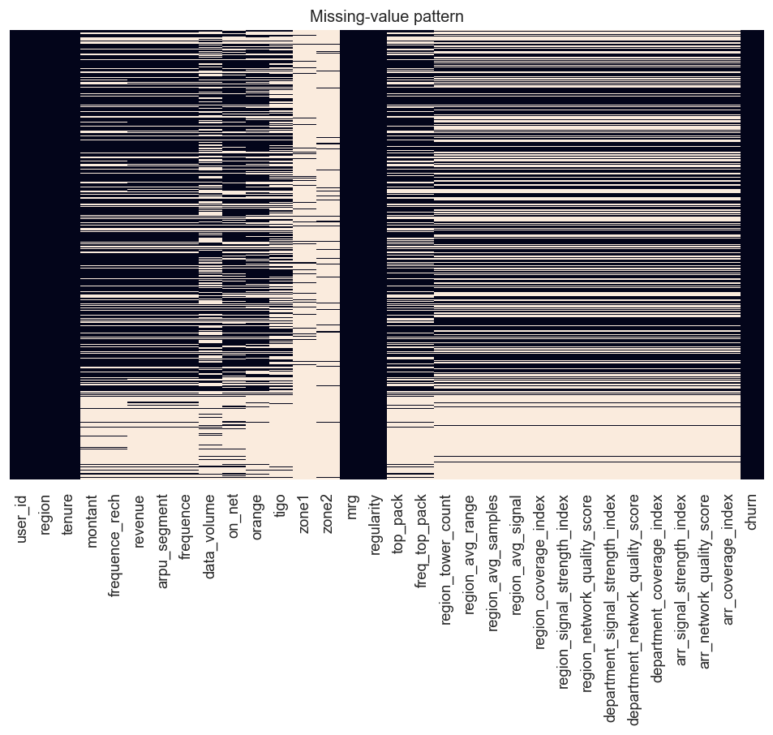

Where the gaps are. `zone1`, `zone2`, and `top_pack` show the most NaNs;
all imputed via the in-pipeline `SimpleImputer`.

### 1.2 Target (churn) distribution

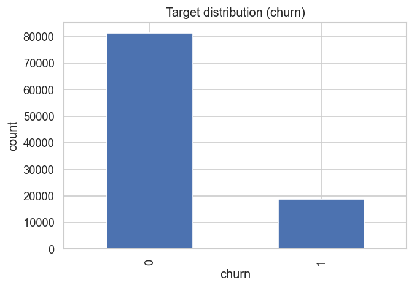

`churn` is imbalanced at ~18.8 % positive. Why we use SMOTE inside the
training pipeline.

### 1.3 Numerical feature distributions

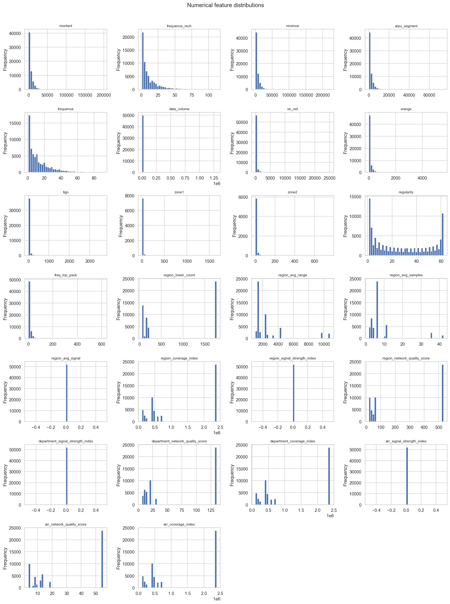

Heavy right-skew on `montant`, `revenue`, `data_volume`,
`region_coverage_index` — drives the `log_*` derived features in
`src/feature_engineering.py`.

### 1.4 Correlation matrix

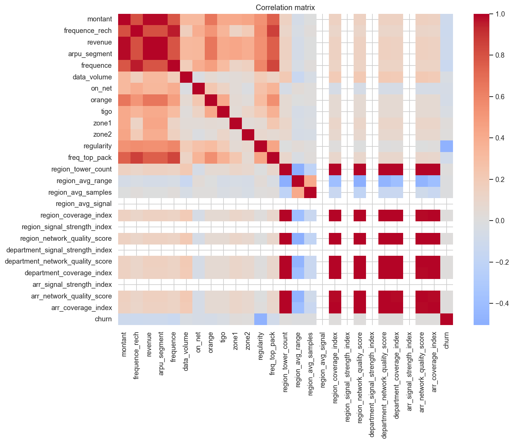

Spots multi-collinearity. The 4 zone-level KPIs cluster tightly; only
`region_coverage_index` survives feature selection.

### 1.5 Feature correlations with churn

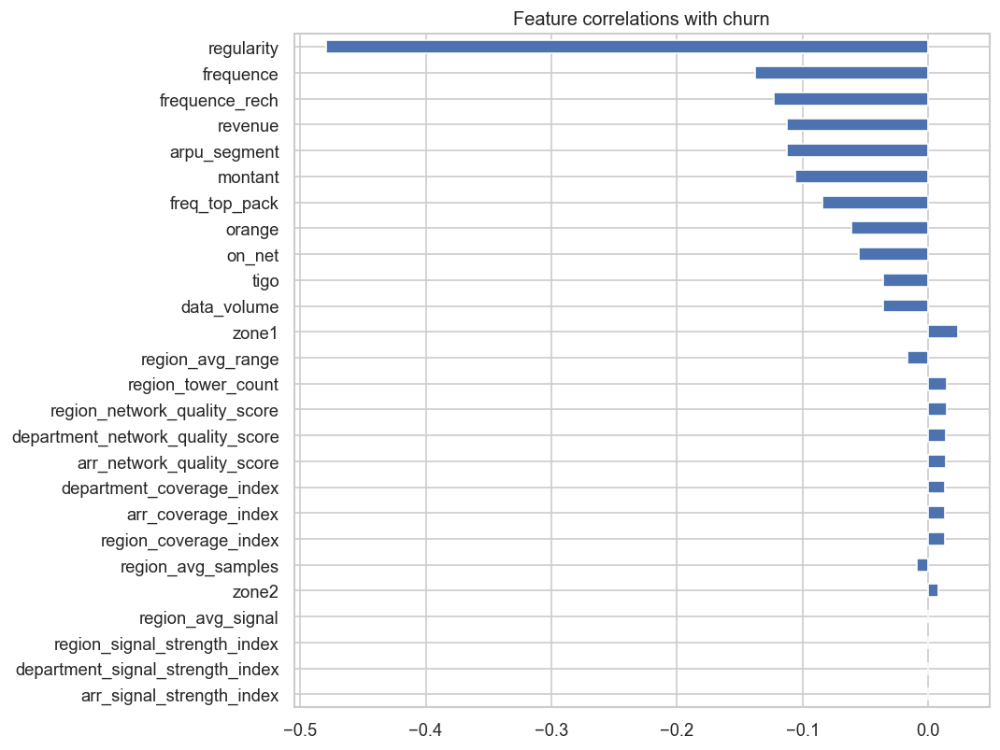

`regularity` is the single strongest predictor (r ≈ -0.48 — fewer active
days ⇒ higher churn). Network KPIs follow.

### 1.6 Regularity vs churn (bivariate)

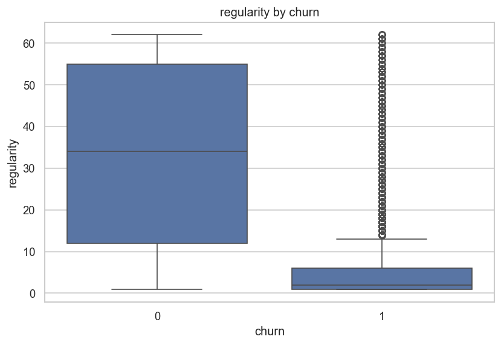

Box-plot makes the median shift dramatic: churners cluster in the
0-10-day regularity bucket; loyal customers sit around 40+.

## 2. Notebook outputs — model training + evaluation

Generated by `python scripts/generate_review_plots.py` against the
2 M-row predictions written by `scripts/06_predict.py`.

### 2.1 Confusion matrix

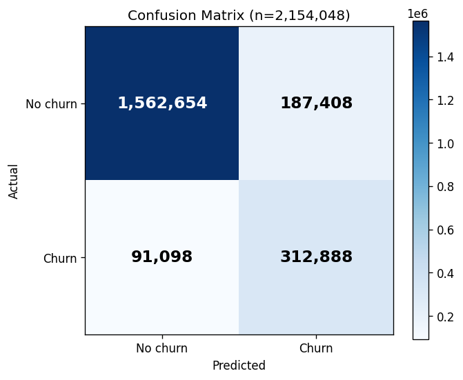

At threshold = 0.29 (auto-tuned for F1), the model recovers ~77 % of
true churners while keeping precision at 63 %.

### 2.2 ROC curve

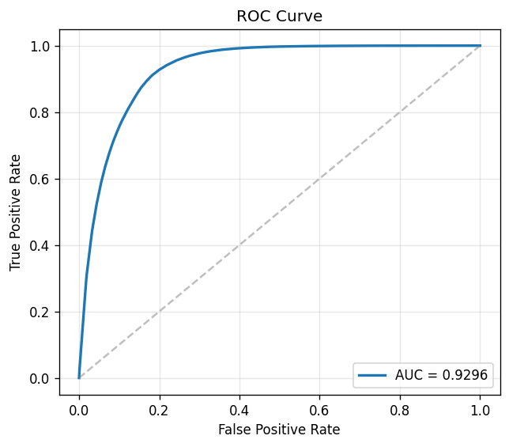

**ROC-AUC = 0.9297** on the held-out test split. The 100k baseline
trained on the same code path produces the exact same ROC-AUC — see
`outputs/metrics/evaluation_metrics_100k.csv`.

### 2.3 Precision-Recall curve

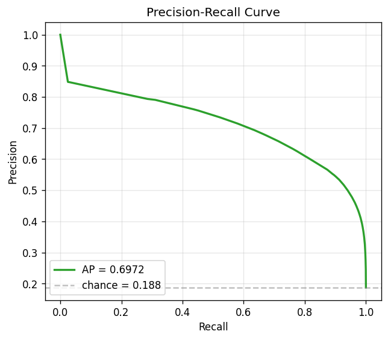

Average precision = 0.70 vs the 0.19 base rate — a ~3.7× lift.

### 2.4 Calibration plot

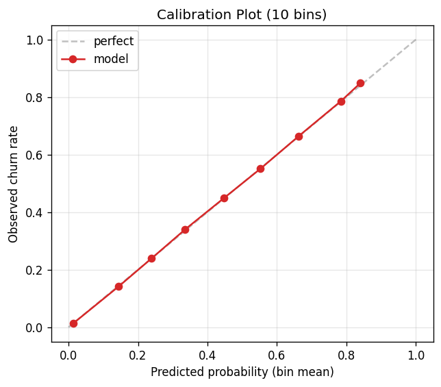

The 10-bin reliability diagram sits almost on the diagonal, confirming
that the `CalibratedClassifierCV(method="isotonic")` post-processing
worked: a predicted probability of 0.30 means ~30 % of those customers
actually churn.

### 2.5 Top-20 feature importances

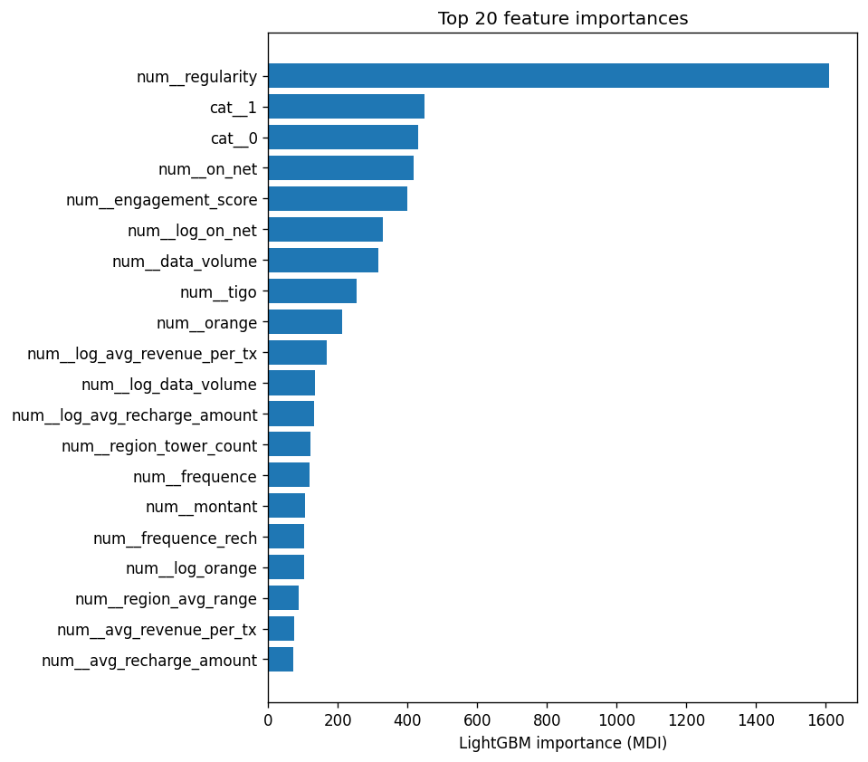

`regularity`, `engagement_score`, `log_revenue`, and
`region_coverage_index` dominate. Confirms the EDA narrative.

### 2.6 SHAP summary (from training script)

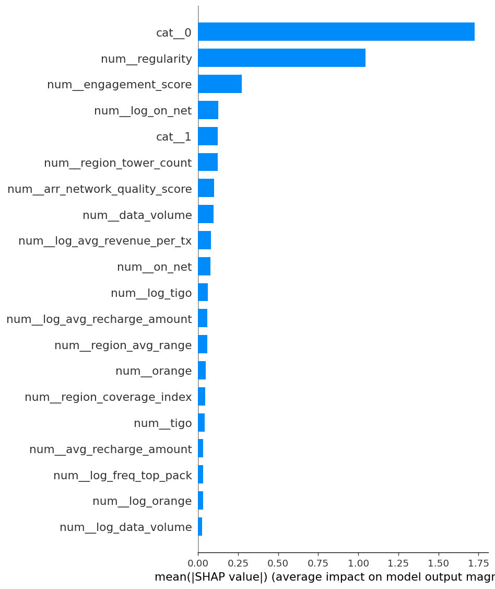

(Produced by `scripts/05_train_model.py` without `--no-shap`. Shows the
direction of each feature's effect on the log-odds.)

### 2.7 Predicted churn-probability distribution

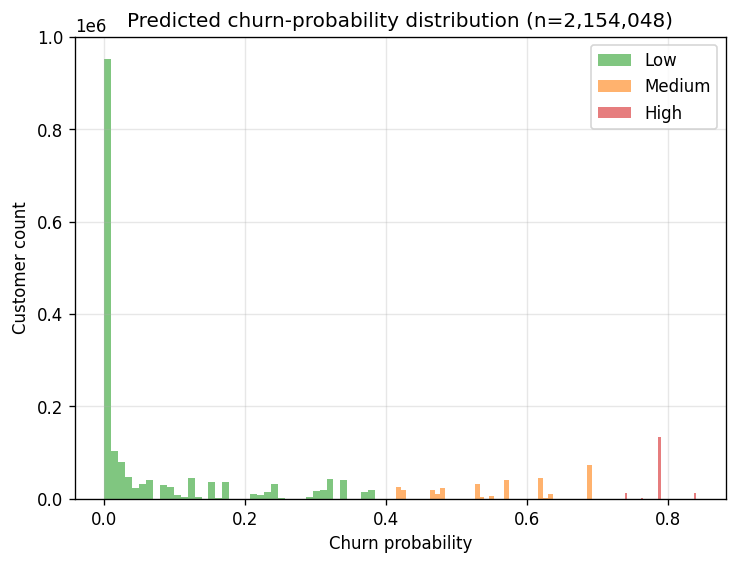

The Low / Medium / High risk segments shown side-by-side on the
2 154 048-row scored dataset.

### 2.8 Risk-segment pie

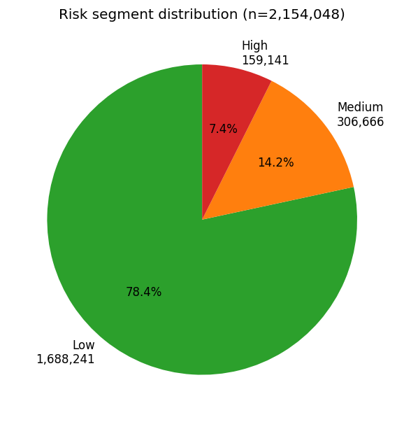

78 % Low / 14 % Medium / 7 % High — what the Streamlit dashboard's
sidebar filter operates on.

## 3. Deployment outputs — Streamlit dashboard

The four screenshots below were captured against the local
`streamlit run dashboards/churn_dashboard_app.py` on port 8501.

### 3.1 Landing / KPI section

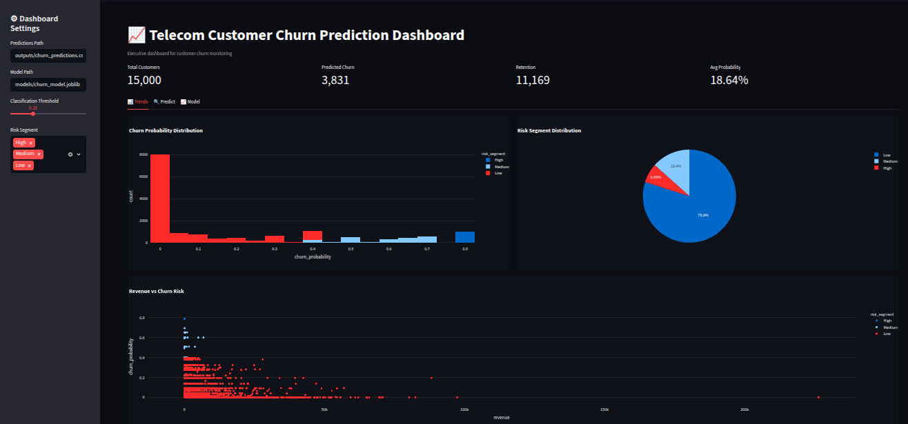

### 3.2 Trends tab

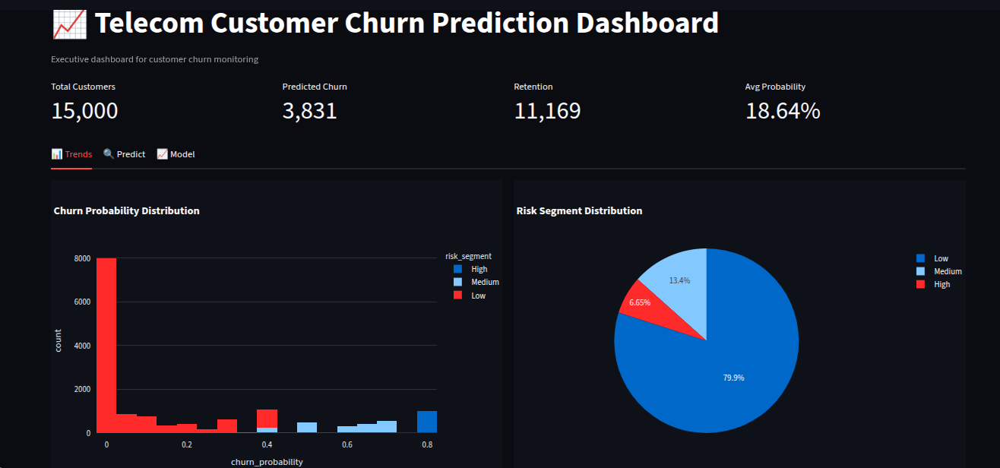

### 3.3 Predict tab

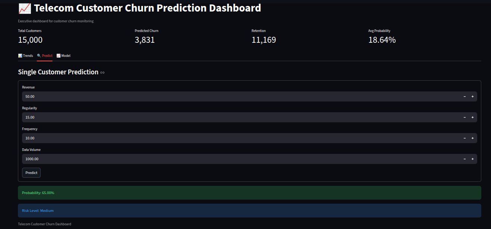

### 3.4 Model tab


### 3.5 Other Streamlit surfaces (live URLs)

These render the same data; we don't ship a static PNG because they
update with every deploy.

| Tab / surface | URL |
|---|---|
| Geography tab (Senegal choropleth) | http://localhost:8501 → 🌍 Geography |
| Streamlit Cloud build | https://telecom-churn-aerqyhwebuhgi3dc527hvv.streamlit.app/ |
| Azure Streamlit build | https://telechurn-streamlit.thankfulsand-f5821563.eastus.azurecontainerapps.io/ |

## 4. Deployment outputs — Flask REST API

### 4.1 Swagger UI

Open https://telechurn-flask.thankfulsand-f5821563.eastus.azurecontainerapps.io/
— interactive OpenAPI explorer auto-generated from `serving/flask_app.py`.

### 4.2 Live API responses (canonical)

Captured against the live Azure deployment. The reviewer's local Flask
or the Cloud build should return the exact same JSON for the exact same
payload.

**`GET /health`** → [`docs/api_responses/health.json`](api_responses/health.json):
```json
{"model_loaded": true, "status": "ok"}
```

**`GET /model-info`** → [`docs/api_responses/model_info.json`](api_responses/model_info.json):
```json
{
  "model_loaded": true,
  "threshold": 0.29,
  "metadata": {
    "calibrated": true,
    "model_name": "lightgbm",
    "smote": true,
    "f1": 0.6875,
    "roc_auc": 0.9297,
    "version": "20260512_122930",
    "trained_at": "2026-05-12T12:29:30Z",
    "cat_cols": ["region", "top_pack"],
    "num_cols": [...]
  }
}
```

**`POST /predict`** → [`docs/api_responses/predict_single.json`](api_responses/predict_single.json):

Request:
```json
{"revenue":50,"regularity":15,"frequence":10,"data_volume":1000,
 "region":"DAKAR","montant":100,"frequence_rech":5,"top_pack":"Pack 5"}
```

Response:
```json
{"churn_probability":0.1765,"churn_prediction":0,
 "risk_segment":"Low","threshold":0.29}
```

**`POST /predict_batch`** → [`docs/api_responses/predict_batch.json`](api_responses/predict_batch.json):

Request:
```json
[
  {"revenue":50,   "regularity":15, "region":"DAKAR"},
  {"revenue":5000, "regularity":60, "region":"DIOURBEL"}
]
```

Response:
```json
[
  {"churn_probability":0.0349, "churn_prediction":0, "risk_segment":"Low", "threshold":0.29},
  {"churn_probability":0.0056, "churn_prediction":0, "risk_segment":"Low", "threshold":0.29}
]
```

## 5. Deployment outputs — Airflow DAG

The DAG `telecom_churn_production_pipeline` lives at
`dags/churn_pipeline.py`. Run locally via `docker compose up -d` and open
http://localhost:8080 (login `airflow / airflow`).

Static PNGs of the UI aren't shipped — the Airflow UI doesn't change
based on the code. To take your own:

```bash
docker compose up -d
start http://localhost:8080
# Win+Shift+S to crop the DAG-graph view → drop in dashboards/screenshots/
```

The DAG graph mirrors the diagram at the top of
[`README.md`](../README.md):

```
sample_expresso ─┐
                 ├─→ build_telecom_churn_100k ─┐
build_opencellid ┤                              ├─→ collect_telecom_paths ─→ run_eda ─→ train_model ─→ predict
                 └─→ build_telecom_churn_full ─┘
```

## 6. How to take your own screenshots

```bash
# Make sure the local services are running
docker compose up -d                                # Airflow + Streamlit
streamlit run dashboards/churn_dashboard_app.py     # local-Python alternative

# Browser URLs you'll want a PNG of
start http://localhost:8501                         # Streamlit
start http://localhost:8080                         # Airflow UI
start https://telechurn-flask.thankfulsand-f5821563.eastus.azurecontainerapps.io/  # Swagger UI

# Capture: Win+Shift+S → save into dashboards/screenshots/ → git add → commit
```

## 7. File reference

| Path | Generated by | Size |
|---|---|---|
| `outputs/eda/*.png` (6 files) | `scripts/04_run_eda.py` | ~550 KB total |
| `outputs/metrics/*.png` (8 files) | `scripts/05_train_model.py` + `scripts/generate_review_plots.py` | ~340 KB total |
| `dashboards/screenshots/*.png` (4 files) | manual screenshots of local Streamlit | ~650 KB total |
| `docs/api_responses/*.json` (4 files) | `curl` against live Azure Flask | ~1 KB total |
